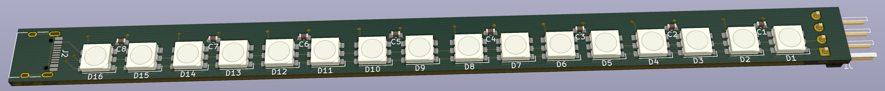
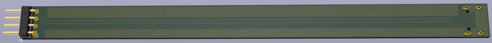

Photon
===========================

Photom is a bluetooth-based shutter release and has some RGB LEDs for light painting. Based on ESP32-WROVER-E and written in Rust.

------------

LED bar prototype V2 (with APA102)

